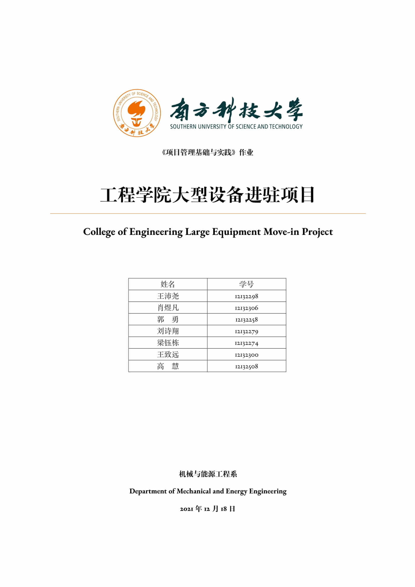

<div id="top"></div>

[![Contributors][contributors-shield]][contributors-url]
[![Forks][forks-shield]][forks-url]
[![Stargazers][stars-shield]][stars-url]
[![Issues][issues-shield]][issues-url]
[![Apache License 2.0][license-shield]][license-url]

<br />
<div align="center">
  <a href="https://github.com/svegio/MEE5002">
    
  </a>

  <h3 align="center">MEE5002: Project Management</h3>

  <p align="center">
    A GitHub repository for project management!
    <br />
    <a href="https://github.com/svegio/MEE5002"><strong>Explore the docs »</strong></a>
    <br />
    <br />
    <a href="https://svegio.github.io">View Demo</a>
    ·
    <a href="https://github.com/svegio/MEE5002/wiki">Check Wiki</a>
    ·
    <a href="https://github.com/svegio/MEE5002/issues">Report Bug</a>
    ·
    <a href="https://github.com/svegio/MEE5002/issues">Request Feature</a>
  </p>
</div>


<!-- TABLE OF CONTENTS -->
<details>
  <summary>Table of Contents</summary>
  <ol>
    <li>
      <a href="#about-the-project">About The Project</a>
      <ul>
        <li><a href="#built-with">Built With</a></li>
      </ul>
    </li>
    <li>
      <a href="#getting-started">Getting Started</a>
      <ul>
        <li><a href="#prerequisites">Prerequisites</a></li>
        <li><a href="#installation">Installation</a></li>
      </ul>
    </li>
    <li><a href="#usage">Usage</a></li>
    <li><a href="#roadmap">Roadmap</a></li>
    <li><a href="#contributing">Contributing</a></li>
    <li><a href="#license">License</a></li>
    <li><a href="#contact">Contact</a></li>
    <li><a href="#acknowledgments">Acknowledgments</a></li>
  </ol>
</details>


<!-- ABOUT THE PROJECT -->
## About The Project

<div align="center">
  
</div>

Here's why I create this project management template:
* Your time should be focused on creating something amazing. A project that solves a problem and helps others
* You shouldn't be doing the same tasks over and over like creating a README from scratch
* You should implement DRY principles to the rest of your life :smile:

Of course, no one template will serve all projects since your needs may be different. So I'll be adding more in the near future. You may also suggest changes by forking this repository and creating a pull request or opening an issue. Thanks to all the people have contributed to expanding this template!

<p align="right">(<a href="#top">back to top</a>)</p>


### Built With

The main frameworks used in this repository are listed below.

* [Poetry](https://github.com/python-poetry/poetry)
* [MkDocs](https://github.com/mkdocs/mkdocs)

<p align="right">(<a href="#top">back to top</a>)</p>


<!-- GETTING STARTED -->
## Getting Started

This is an example of how you may give instructions on setting up your project locally. To get a local copy up and running follow these simple example steps.

### Prerequisites

[Poetry]((https://github.com/python-poetry/poetry)) provides a custom installer that will install poetry isolated from the rest of your system.

### Installation

_Below is an example of how you can instruct your audience on installing and setting up your app. This template doesn't rely on any external dependencies or services._

1. Clone the repository
   ```sh
   git clone https://github.com/svegio/MEE5002.git
   cd MEE5002
   ```
2. Install dependencies via Poetry
   ```sh
   poetry install
   ```
3. Start the preview server
   ```sh
   poetry run mkdocs serve
   ```

<p align="right">(<a href="#top">back to top</a>)</p>


<!-- USAGE EXAMPLES -->
## Usage

Manage your own project by modifying the content of specific Markdown files under [section](docs/section) folder. For more template examples, please refer to the [Documentation](https://www.mkdocs.org)

<p align="right">(<a href="#top">back to top</a>)</p>


<!-- ROADMAP -->
## Roadmap

- [x] [Introduction](docs/section/background.md)
- [x] [Initiating Process Group](docs/section/initiate.md)
- [x] [Planning Process Group](docs/section/plan.md)
- [x] [Executing Process Group](docs/section/execute.md)
- [x] [Monitoring and Controlling Process Group](docs/section/monitor.md)
- [x] [Closing Process Group](docs/section/close.md)
- [x] [Summary](docs/section/conclusion.md)
- [x] [References](docs/section/reference.md)
- [x] [Appendices](docs/section/appendix.md)

See the [open issues](https://github.com/svegio/MEE5002/issues) for a full list of proposed features (and known issues).

<p align="right">(<a href="#top">back to top</a>)</p>


<!-- CONTRIBUTING -->
## Contributing

Contributions are what make the open source community such an amazing place to learn, inspire, and create. Any contributions you make are **greatly appreciated**.

If you have a suggestion that would make this better, please fork the repository and create a pull request. You can also simply open an issue with the tag "enhancement".
Don't forget to give the project a star! Thanks again!

1. Fork the Project
2. Create your Feature Branch (`git checkout -b feature/AmazingFeature`)
3. Commit your Changes (`git commit -m 'Add some AmazingFeature'`)
4. Push to the Branch (`git push origin feature/AmazingFeature`)
5. Open a Pull Request

<p align="right">(<a href="#top">back to top</a>)</p>


<!-- LICENSE -->
## License

Distributed under the Apache License 2.0. See `LICENSE` for more information.

<p align="right">(<a href="#top">back to top</a>)</p>


<!-- CONTACT -->
## Contact

Iydon Liang - liangiydon@gmail.com

Project Link: [https://github.com/svegio/MEE5002](https://github.com/svegio/MEE5002)

<p align="right">(<a href="#top">back to top</a>)</p>


<!-- ACKNOWLEDGMENTS -->
## Acknowledgments

I use this space here to list resources that I have found helpful and would like to give credit to.

* [Web File Browser](https://github.com/filebrowser/filebrowser)
* [CodiMD - Realtime collaborative markdown notes on all platforms](https://github.com/hackmdio/CodiMD)
* [Chinese copywriting guidelines for better written communication](https://github.com/sparanoid/chinese-copywriting-guidelines)
* [Laws, Theories, Principles and Patterns that developers will find useful](https://github.com/dwmkerr/hacker-laws)
* [Open source emojis for designers, developers and everyone else](https://github.com/hfg-gmuend/openmoji)
* [GitHub Pages](https://pages.github.com)

<p align="right">(<a href="#top">back to top</a>)</p>


<!-- MARKDOWN LINKS & IMAGES -->
[contributors-shield]: https://img.shields.io/github/contributors/svegio/MEE5002.svg?style=for-the-badge
[contributors-url]: https://github.com/svegio/MEE5002/graphs/contributors
[forks-shield]: https://img.shields.io/github/forks/svegio/MEE5002.svg?style=for-the-badge
[forks-url]: https://github.com/svegio/MEE5002/network/members
[stars-shield]: https://img.shields.io/github/stars/svegio/MEE5002.svg?style=for-the-badge
[stars-url]: https://github.com/svegio/MEE5002/stargazers
[issues-shield]: https://img.shields.io/github/issues/svegio/MEE5002.svg?style=for-the-badge
[issues-url]: https://github.com/svegio/MEE5002/issues
[license-shield]: https://img.shields.io/github/license/svegio/MEE5002.svg?style=for-the-badge
[license-url]: https://github.com/svegio/MEE5002/blob/main/LICENSE
