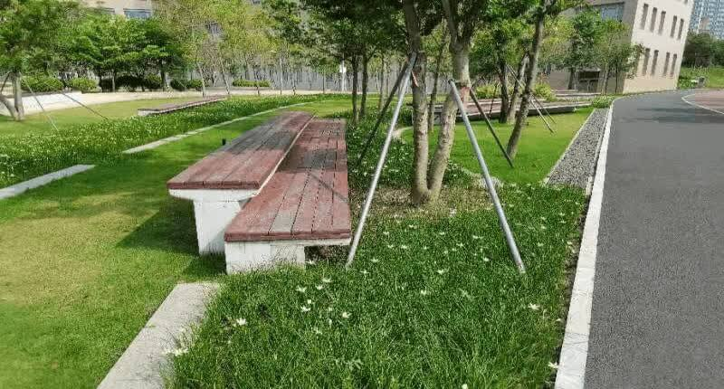
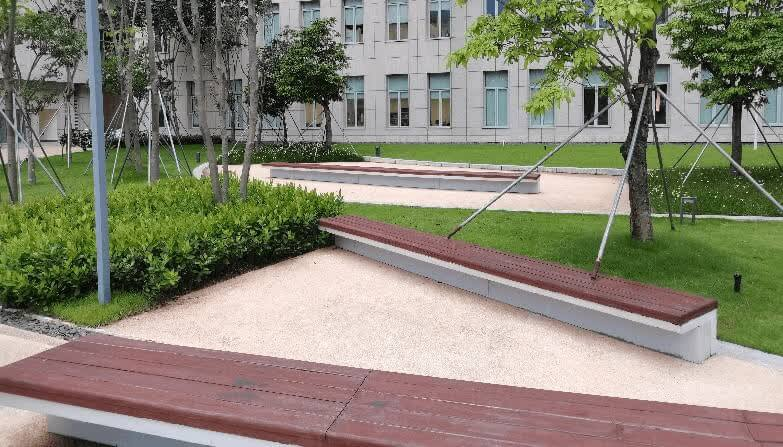
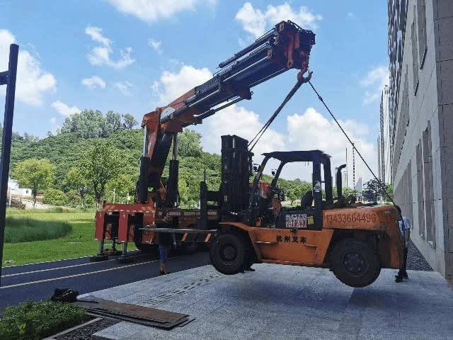
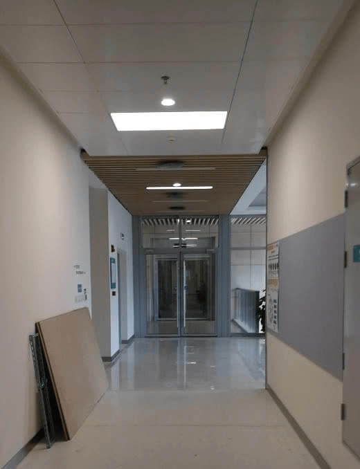

# 项目背景
## 工学院大楼基本情况
- **规模**：工学院是南科大成立的第一个学院，工学院新大楼总占地面积 11.5 万平方米，总建筑面积约 6.7 万平方米，由南、北两栋建筑组成。其中，南楼九层，建筑平面呈 C 型，建筑高度 42.3 米，总建筑面积约 47,000 平方米。北楼十层，建筑平面呈 U 型，建筑髙度 46.8 米，总建筑面积约 67,000 平方米。南北楼共用地下室一层，面积近 2 万平方米，约有停车位 350 个。工学院大楼空间主要分配给学院下属8个系（院）。其中，北楼有材料科学与工程系、力学与航空航天工程系、机械与能源工程系和环境科学与工程学院，南楼有电子与电气工程系、海洋科学与工程系、生物医学工程系和计算机科学与工程系。
- **愿景**：工学院大楼将容纳 5,000 余名致力于未来科学发展的学者与科学家，致力于探索工程人才培养创新模式，并聚焦产业需求，与企业深度互动，与产业深度对接，促进人才培养、科学研究与成果转化互联互通，走出一条大学与地方产业融合发展的新路径。
- **成果**：工学院初步形成了在国内有一定影响力的工科学院，材料科学、工程学进入 ESI 前 1%，力学学科获批成为一级学科博士学位授予点，光电信息科学与工程获批国家级一流专业建设点，力学、材料科学入选广东省“冲一流、补短板、强特色”提升计划重点建设学科，材料科学与工程、环境科学与工程、通信工程获批省级一流专业建设点，学院发展迈入新的阶段，为建设世界一流的工学院奠定了坚实基础。

## 工学院大楼现有问题
工学院大楼满足了各院系的大多数的基本需求，但仍然存在许多问题，如：电梯太少、**中庭绿植设计不合理**、楼层内缺乏标识、停车场震动影响精密仪器、自主贩卖机少、缺乏商品店铺、厕所同侧两进门、**大型设备难以进出**、楼内信号不好等问题。

我们项目小组认为中庭绿植设计不合理以及大型设备难以进出这两个问题相比其他问题来说更加关键，是更有价值去优化和改进的两个痛点。我们小组进一步深入分析，中庭绿植设计不合理问题表现为中庭空间利用率较低，座椅、道路、绿植的设计相互矛盾。首先，部分座椅设置在草丛中间而不是道路两侧，华而不实，不方便给经过的路人做下休息。其次，道路设计不合理，某些路段相对较窄，加之旁边还设置有座椅，在人流量大的情况下会造成人员拥挤。最后，工学院容纳人数 5,000 余人，人流量较大，而南北楼两处中庭设计安排了大面积的绿植，而没有设置车棚摆放空地、功能性区域、消防应急空地等，因而两处中庭实际效用较低。为此，我们小组提出几条优化方向：增设车棚、长椅位置调整、中庭草坪及道路重新设计增加功能性区域等。

{ width="49%" }
{ width="46.13%" }

大型设备进出方面，工学院大楼各个进出口面积较小，电梯也存在容量太小的问题，给各个院系搬运大型设备的条件十分有限。每次有大型设备搬运进入工学院都需要吊车、叉车协助搬运，同时还要损坏墙体，破墙而入，效率较低，代价很大。为此，我们小组也提出几条优化方向：合理规划超大、超重设备搬运路线、设置大型货物的吊装平台、建造大型电梯运输等。

{ width="60%" }
{ width="34.51%" }

因为项目小组的时间和精力有限，我们无法同时完成中庭绿植优化和大型设备运输两个项目，进过多次组内讨论和分析，我们小组最终选择大型设备运输项目作为我们小组继续深入的方向。
