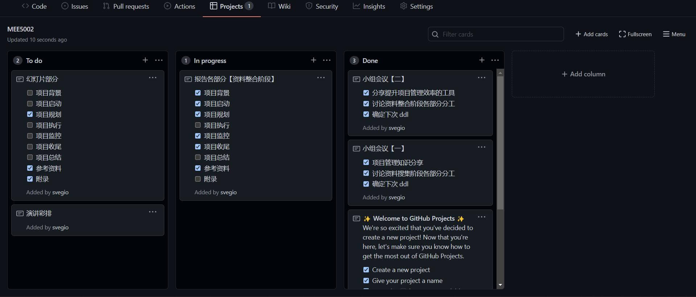
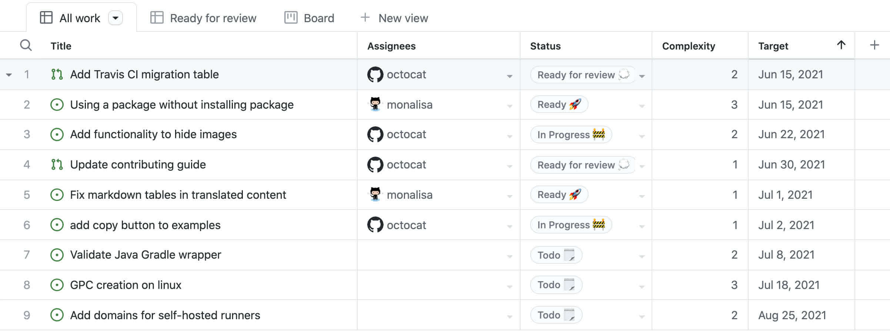
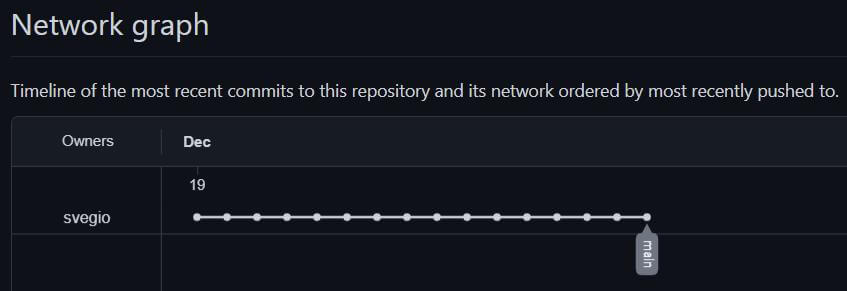
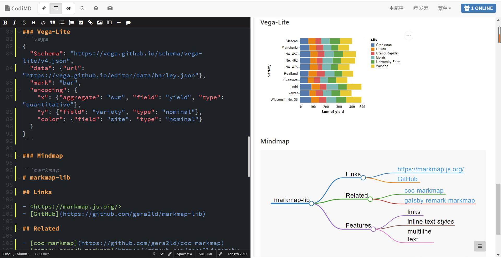
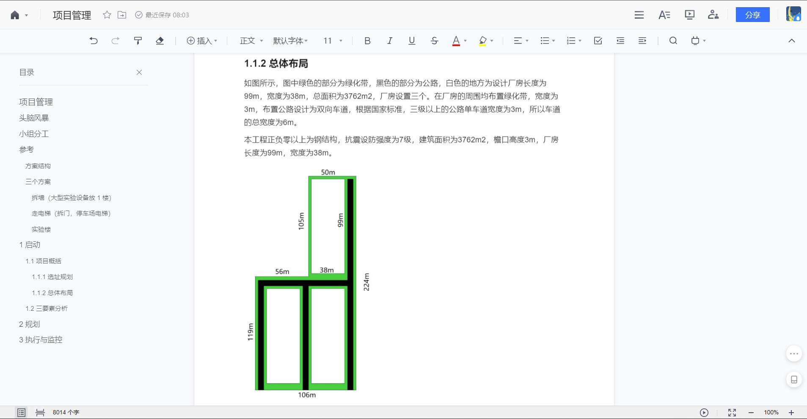
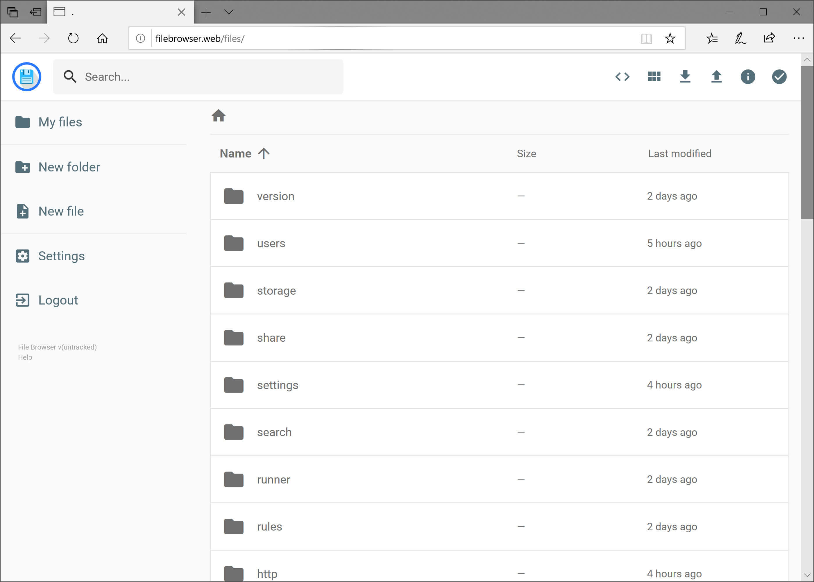
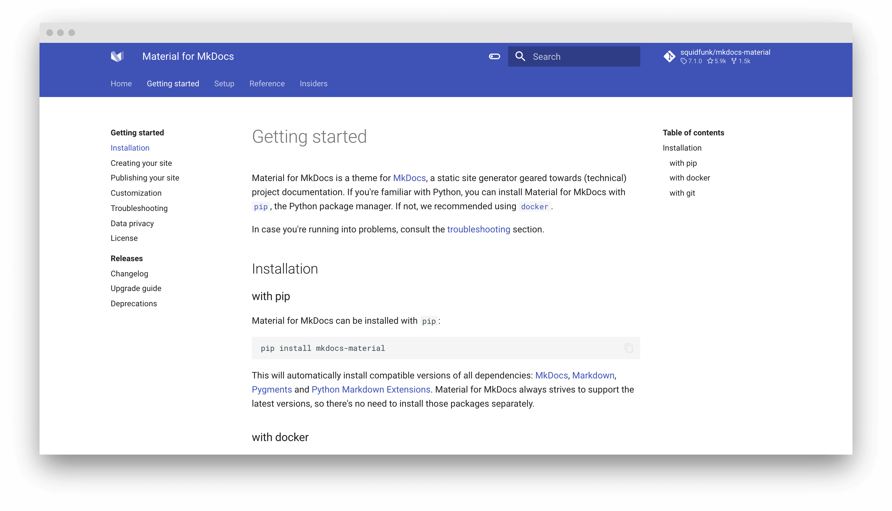

# 项目收尾
{ width="75%" }

项目收尾主要用于存档项目与阶段信息，完成计划的工作，释放组织资源以开展新的工作。通过此次项目管理 Project，我们学到了很多知识，同时也摸索出了一系列实用的工具，可以将原先繁琐的项目管理流程规范化、简单化。

## 版本控制
一个项目可能需要迭代十几版，甚至几十版才能最终交付，因此版本控制对于项目来说至关重要，所以我们小组采用 [GitHub](http://github.com/svegio/MEE5002) 对此次项目进行了托管，并对其辅助项目完成的各项功能进行学习与掌握。例如我们的项目就采用了 [GitHub Project Boards](https://docs.github.com/en/issues/organizing-your-work-with-project-boards/managing-project-boards/about-project-boards) 进行规划。

<figure markdown> 
    { width="100%" }
    <figcaption>GitHub Project Boards</figcaption>
</figure>

此外，GitHub Project 还有 [Beta](https://docs.github.com/en/issues/trying-out-the-new-projects-experience) 版本，等服务稳定下来我们会继续尝试。

<figure markdown> 
    { width="100%" }
    <figcaption>GitHub Project Beta</figcaption>
</figure>

GitHub 针对项目贡献的可视化与评估口碑也很好，但是此次项目涉及到代码的部分很少，所以这部分没有充分利用，希望以后的项目中可以体验。

<figure markdown> 
    { width="75%" }
    <figcaption>GitHub Network Graph</figcaption>
</figure>

最后，GitHub 的另一个好用的工具是 [Issues](https://docs.github.com/en/issues/tracking-your-work-with-issues/about-issues)，类似课程中讲的敏捷开发，项目团队可以和使用者进行高效的沟通，快速修改或增强已有的功能。

<figure markdown> 
    { width="100%" }
    <figcaption>GitHub Issues</figcaption>
</figure>

## 资料共享
在项目管理中，团队之间的资料共享也是令人头疼的一环，通过艰苦卓绝的摸索，我们最后构建了以 [CodiMD](https://github.com/hackmdio/CodiMD) 合作报告小片段、[腾讯文档](https://docs.qq.com/)合作报告最终版、[Web File Browser](https://github.com/filebrowser/filebrowser) 合作整理文件的资料共享工具链。

<figure markdown> 
    { width="100%" }
    <figcaption>CodiMD</figcaption>
</figure>

<figure markdown> 
    { width="100%" }
    <figcaption>腾讯文档</figcaption>
</figure>

<figure markdown> 
    { width="100%" }
    <figcaption>Web File Browser</figcaption>
</figure>

## 结果展示
项目展示一开始我们打算使用[语雀](https://www.yuque.com/)，但是后来发现了自由度更高的 [MkDocs](https://github.com/mkdocs/mkdocs)，并且配置了打印页的功能，将报告与展示合二为一，减少了团队的工作量。

<figure markdown> 
    { width="100%" }
    <figcaption>Material for MkDocs</figcaption>
</figure>
