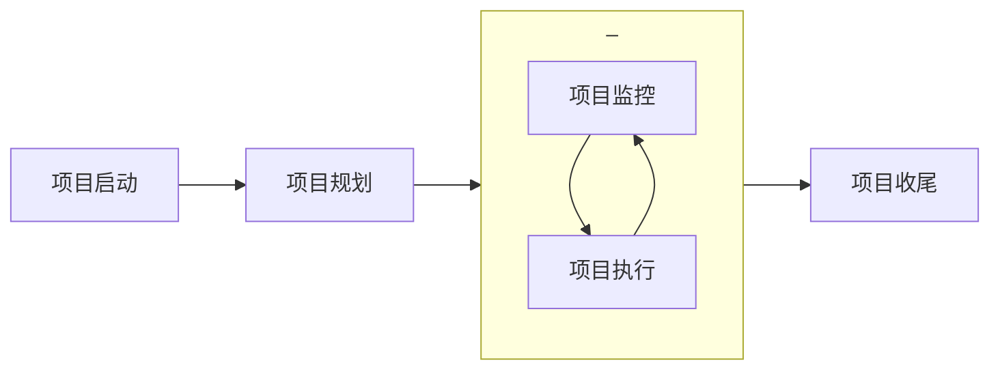

# 项目总结
## 项目流程



## 优点与不足
```markmap
- 优点
    - 团队执行力强，不同尺度的任务调度上均较为灵活
    - 负责人之间在遇到问题后可以积极交流沟通，互通有无
    - 团队两次会议高效，分配任务较为均匀，人尽其才
    - 项目管理部分基本达标，团队均熟悉项目管理流程
- 不足
    - 项目尺度选取较大，部分流程未能完美复现
    - 缺乏实际经验，时间与成本方面的考量不够严谨
```
