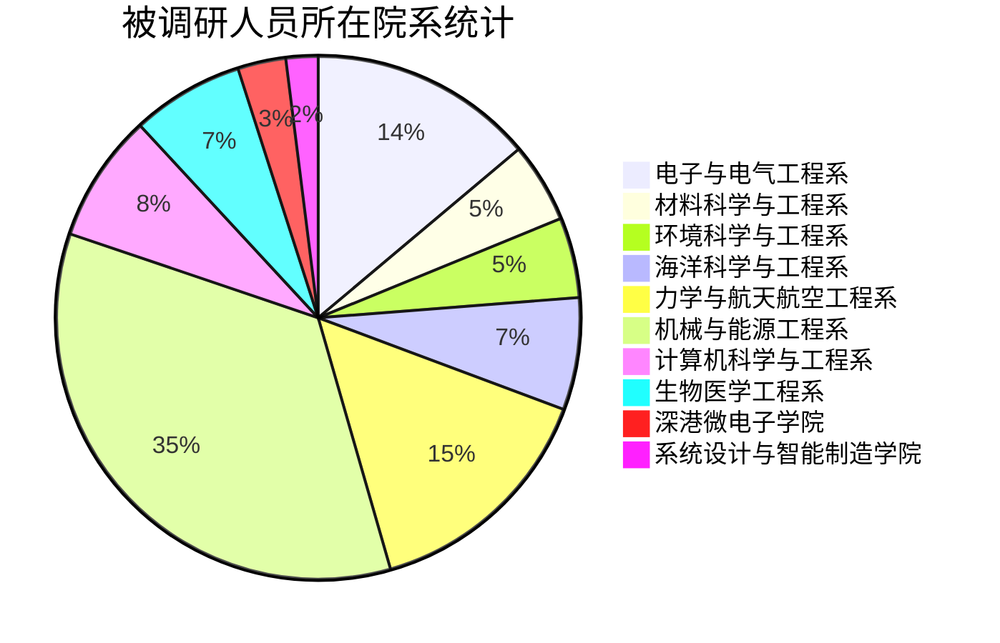
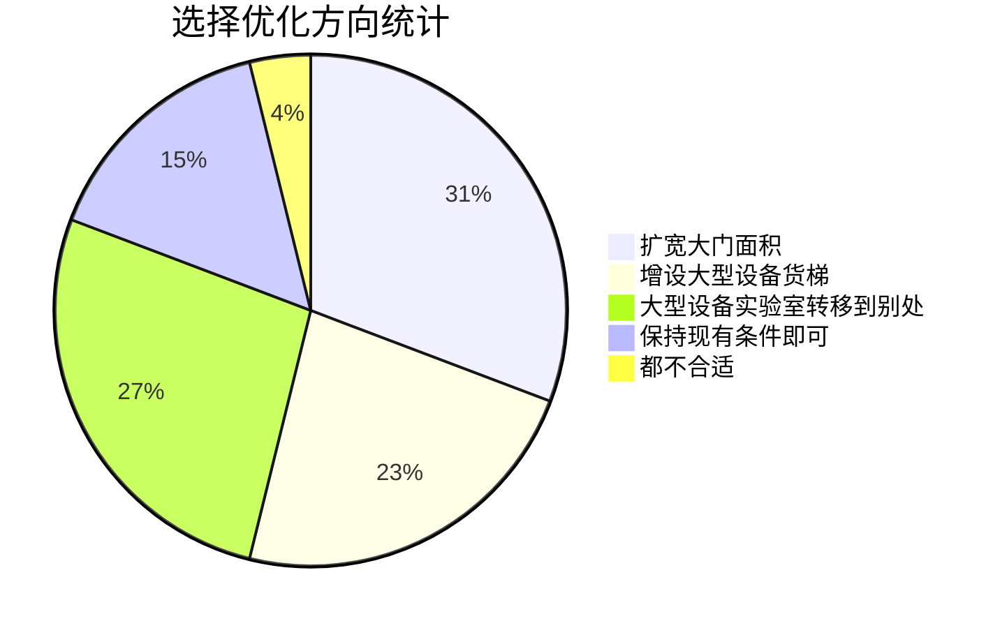

# 项目启动
## 项目章程
- **项目目的**
    - 工学院大型设备运输问题得到充分全方面地解决，大型设备可以高效率地顺利地搬运到目标位置，工学院形成一套完整的处理大型设备搬运的系统或同等替代方案。
- **可测量的项目目标和相关的成功标准**
    - 项目方案可以满足各院系实验室需求，可以满足各种不同类型、尺寸和形状的设备搬运，有相应的异常情况处理方案来应对搬运意外情况。
- **高层级需求**
    - 项目方案得到各院系教授和科研人员的高度认可，项目方案以高效率、低沉本、最优化方式解决大型设备搬运进入工学院问题，形成一整套工学院大型设备搬运流程指南，指导各院系实验室按照指南高效完成搬运。
- **高层级项目描述、边界定义以及主要可交付成果**
    - 一套可行的、完整的、高效的大型设备搬运项目方案或同等可替代方案，可以低损耗、低成本的完成绝大多数大型设备搬运任务，得到各院系教授和科研人员的高度认可。
- **整体项目风险**
    - 项目成本过高，项目资金不足的风险；
    - 项目难度系数过高，造成人员伤亡，火灾等意外情况的风险；
    - 项目施工噪声过大、粉尘过多影响工学院科研人员工作的风险；
    - 施工堵塞交通的风险；
    - 施工造成工学院大楼结构破损（电线管道系统被损坏等情况）的方向。
- **关键相关方名单**[^1]

[^1]: 工学院领导指代工学院各级行政领导，院长以及工学院各个院系系主任；项目小组指代本项目策划小组，人员包括王沛尧、肖煜凡、郭勇、刘诗翔、梁钰栋、王致远、高慧。

| 人员 | 角色与关系 |
| :-: | :-: |
| 工学院各实验室 | 需求端 |
| 工学院领导 | 监管者 |
| 外包施工方 | 方案执行者 |
| 项目小组 | 方案提出者 |

- **预先批准的财务资源**
    - 项目启动资金100万元，后续的资金根据项目方案具体情况批准（拟）。
- **项目审批要求**
    - 项目所提出的大型设备搬运方案在效率、成本、规格等方面均达到了工学院实验室的要求。项目结束后，由工学院领导进行评审，确定项目是否已经成功。
- **项目退出标准**（项目在出现下述情况时，终止）
    - 项目施工方未能按要求实现大型设备搬运条件的；
    - 项目未通过工学院领导评审的；
    - 项目资源不能支持项目进展的；
    - 项目外部环境出现重大变化，导致项目难以进行下去的；

## 项目前期调研
本次调研旨在调查工学院各院系对大型设备运输的需求，进一步证实工学院各院系的确有大型设备搬运的需求，并且存在搬运大型设备进入工学院困难的问题。

本次调研采用线上**问卷**的形式，节省调研成本并高效获得调研数据，问卷设置合理，题目清晰简洁，选项简单分明，既能节省被调研者的填问卷时间，又能快速收集到足够的问卷。{==问卷内容详见附录 1==}

### 问卷总体情况
本次问卷为避免收到同一实验室多次重复问卷提交，特意将调研对象聚焦到工学院研究生 2021 级新生，等比例减少重复问卷的同时不会过分影响问卷最终的数据情况，方式为限制问卷传播范围，只将问卷转发到各个研究生21级学生群，同时设置单个用户只能填写一次问卷。

本次问卷收到了来自电子电气工程系、材料与科学工程系等十个工学院所属院系的问卷共 101 份，问卷数量充足，问卷数据具有一定的代表性，其中收到机械与能源工程系的答卷最多，占 34.65%，系统设计与智能制造学院的问卷最少，占1.98%。

### 问卷分析结果
分析调研结果，48.51% 的 21 级研究生所在课题组有大型设备的需求，在这部分同学中，有 93.88% 的人碰到大型设备很难搬运进工学院的问题，只有3个人表示所在课题组没有碰到大型设备搬运进工学院的难题。以上几项数据表明：有接近半数的实验室有大型设备的需求，而且这半数实验室中绝大多数实验室都被大型设备如何搬运进工学院这一难题所困扰着，证明大型设备搬运不仅需求面广，也是众多实验室希望解决的一个难点。（为了有清晰的认知和统一的判断标准，我们小组在收集问卷时定义最大直径超过 2.5m 的设备即为大型设备。）

另外，在另一半所在实验室没有大型设备需求的同学中，仍然有 73.08% 的同学认为工学院现有设施很难满足运输大型设备这一难题，由此不难发现大多数同学都认为现有工学院大楼的设施存在不适合大型设备进出的这一结构问题。

在选择优化方向方面，有 30.77% 的同学倾向于扩宽工学院进出口大门面积来解决难以搬运大型设备这一难题，而 23.08% 的同学选择增设大型设备货梯这一解决方案，还有 26.92% 的同学倾向于将大型设备实验室转移到工学院大楼之外合适的地方，而还有 15.38% 的同学认为保持现有工学院的条件即可，不需要做调整。

综合以上调研结果，我们小组一致认为工学院大型设备搬运问题是一个相当大的痛点，而且这一痛点辐射面广，影响深远，是一个急需被解决的一大难题。同时，以上调研也论证了我们小组原有的想法，让我们小组更加坚定地在大型设备搬运这一项目上进一步开展分析讨论，寻找最优的解决方案。
