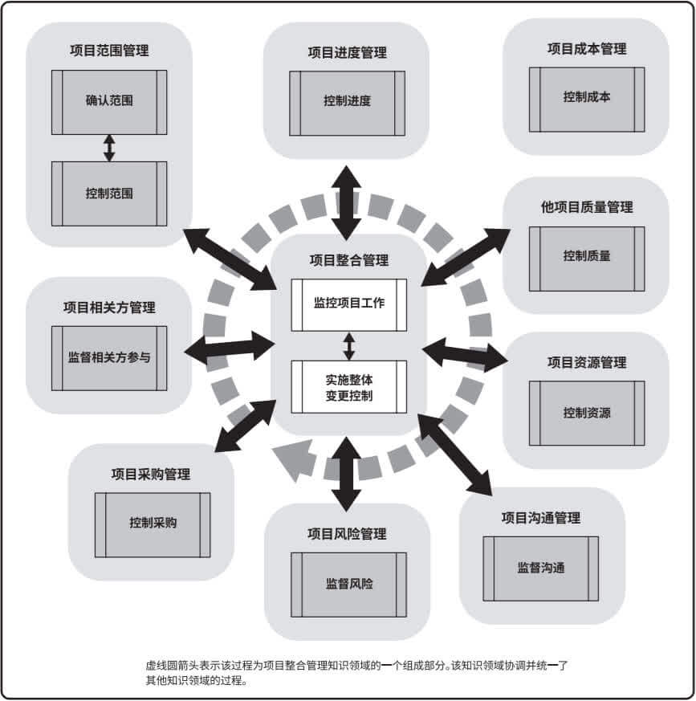

# 项目监控
## 内容
持续的监督使项目团队和其他相关方得以洞察项目的健康状况，并识别需要格外注意的方面。在监控过程组，需要监督和控制在每个知识领域、每个过程组、每个生命周期阶段以及整个项目中正在进行的工作。

{ width="75%" }

## 监控项目工作
跟踪、审查和报告整体项目进展，让团队成员了解项目的当前状态，并通过成本和进度预测，让团队成员了解未来项目状态。在这个过程中利用团队整体的工作进展，每个队员的工作状态，以及队员们最近一段时间工作的心得体会更新一些项目文件，更新的项目文件如下：
- 成本预测；
- 问题日志；
- 经验教训登记册；
- 风险登记册；
- 进度预测。

## 实施整体变更控制
审查所有变更要求，批准变更，管理对可交付成果、组织过程资产、项目文件和项目管理的变更，并对变更结果进行沟通，确保对项目中已记录在案的变更做综合评审。在这个过程中我们团队考虑了变更对整体项目目标以及计划的影响，尽可能地减少整体项目风险。

同时，这个过程中输入的项目管理文件如下：
- 变更管理计划；
- 配置管理计划；
- 范围基准；
- 进度基准；
- 成本基准。

输出文件如下：
- 估算依据；
- 需求跟踪矩阵；
- 风险报告。

## 确认范围
验收已完成的项目，通过确认可交付的成果，来提高最终产品获得验收的可能性。

同时，这个过程中输入的项目管理文件如下：
- 范围管理计划；
- 需求管理计划；
- 范围基准。

本过程输入的项目文件如下：
- 经验教训登记册；
- 质量报告；
- 需求文件；
- 需求跟踪矩阵。

## 控制范围
监督项目和产品的分为状态，管理范围基准变更，以确保在整个项目期间对范围基准的维护。本过程的主要工作是通过输入的项目管理计划、项目文件、工作绩效数据以及组织过程资产，得到变更请求、项目管理计划更新以及项目文件更新。

## 控制进度
监督项目状态，以更新项目进度和管理进度基准变更，以确保整个项目期间保持对进度基准的维护。

本过程更新的项目管理计划组件如下：
- 进度管理计划；
- 进度基准；
- 成本基准；
- 绩效测量基准。

在本过程更新的项目文件如下：
- 假设日志；
- 估算依据；
- 经验教训登记册；
- 项目进度计划；
- 资源日历；
- 风险登记册；
- 进度数据。

## 控制成本
监督项目状态，以更新项目成本和管理成本基准变更，以确保在整个项目期间保持对成本基准的维护。本过程的主要工作是通过输入的项目管理计划、项目文件、项目资金需求、工作绩效数据以及组织过程资产来得到成本预测、变更需求、项目管理计划更新以及项目文件更新。

## 控制质量
监督和记录质量管理活动执行结果，核实项目可交付成果和工作已经达到主要相关方的质量要求，可供最终验收，以确保项目输出完整、正确并满足客户期望。

本过程输入的项目文件如下：
- 经验教训登记册；
- 质量测量指标；
- 测试与评估文件。

本过程更新的项目文件如下：
- 问题日志；
- 经验教训登记册；
- 风险登记册；
- 测试与评估文件。

## 监督沟通
按沟通管理计划和相关方参与计划的要求开展高效的信息传递，使队员之间能够及时的沟通，确保满足项目及其相关方的信息需求。
本过程输入的项目管理计划组件如下：

本过程输入的项目管理计划组件如下：
- 资源管理计划；
- 沟通管理计划；
- 相关方参与计划。

本过程输入的项目文件如下：
- 问题日志；
- 经验教训登记册；
- 项目沟通记录。

## 监督风险
在整个项目期间，监督商定的风险应对计划的实施、跟踪已识别风险、识别和分析新风险，以及评估风险管理有效性，使项目决策都基于关于整体项目风险敞口和单个项目风险的当前信息。

本过程输入的项目文件如下：
- 问题日志；
- 经验教训登记册；
- 风险登记册；
- 风险报告。

本过程更新的项目文件如下：
- 假设日志；
- 问题日志；
- 经验教训登记册；
- 风险登记册；
- 风险报告。

## 监督相关方参与
监督项目相关方关系，并通过修订参与策略和计划来引导相关方合理参与项目，随着项目进展和环境变化，维持或提升相关方参与项目的效率和效果。

本过程更新的项目管理计划组件如下：
- 资源管理计划；
- 沟通管理计划；
- 相关方参与计划。
