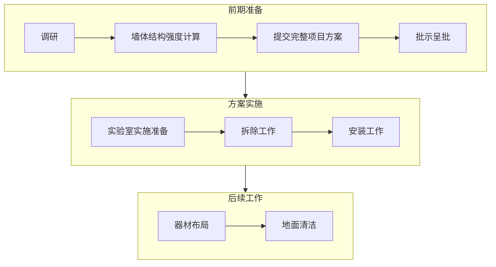
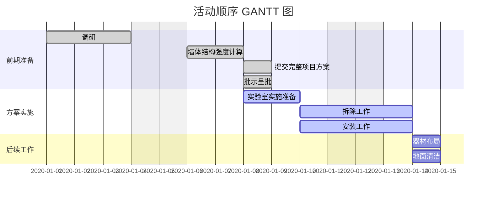
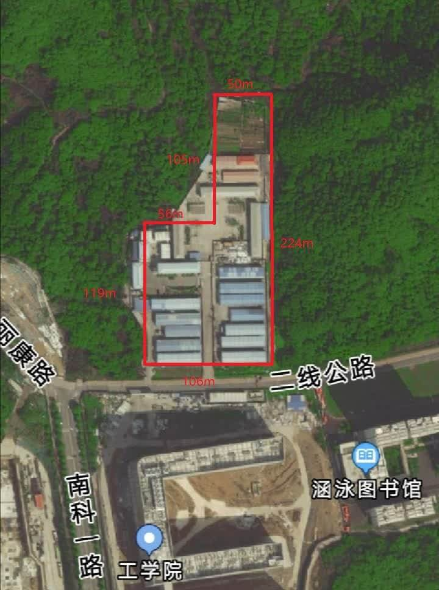
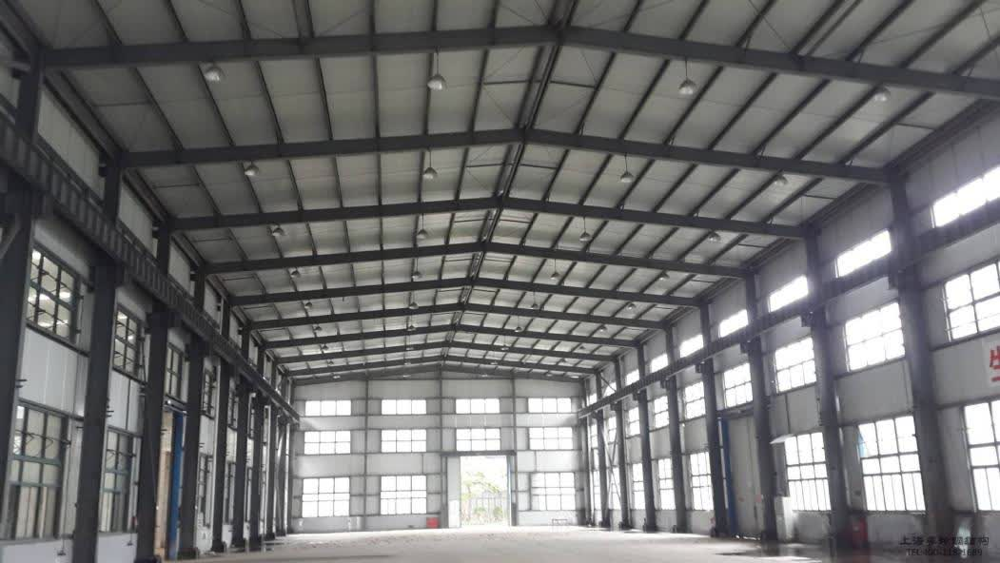
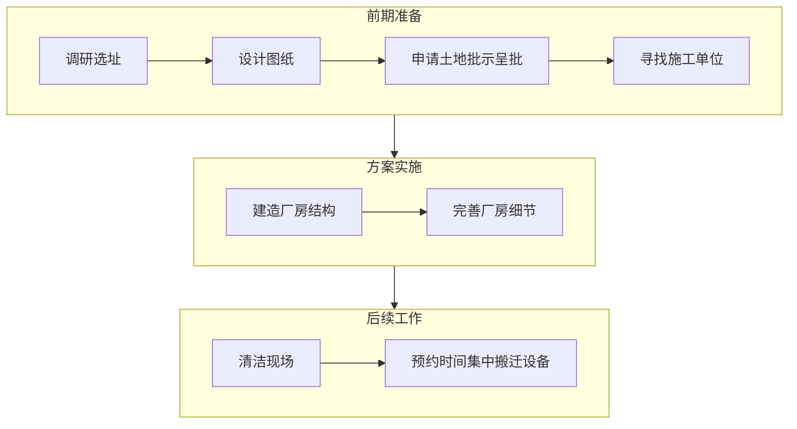
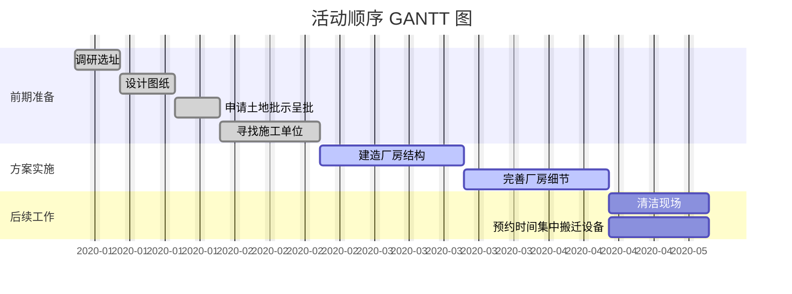
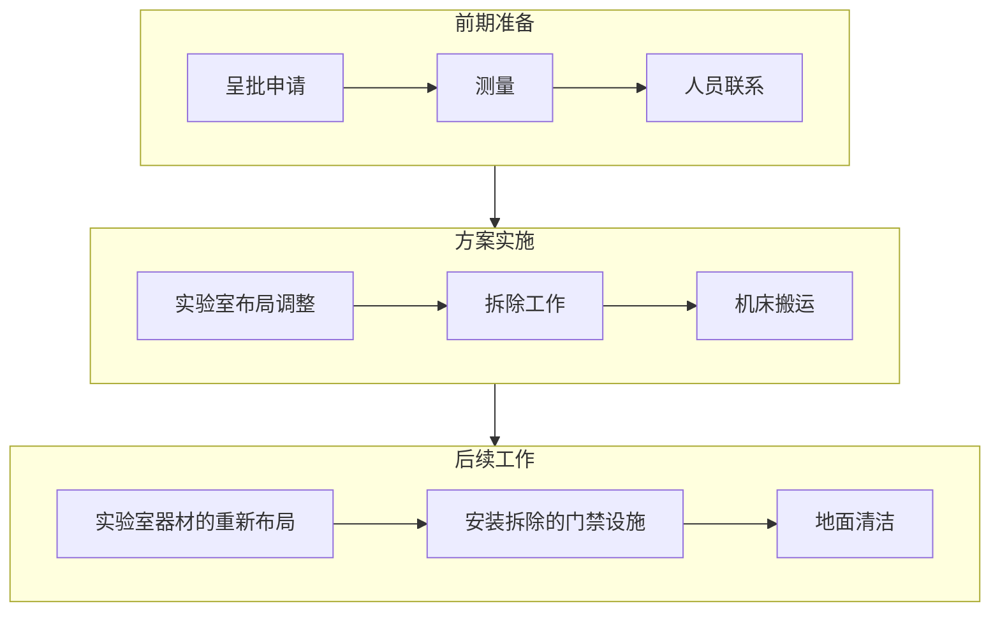
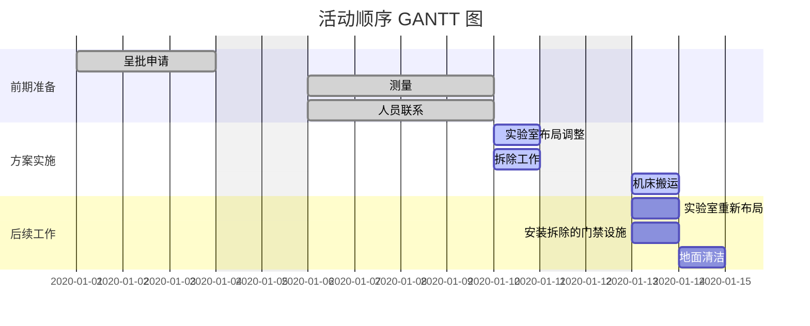

# 项目规划
项目规划过程，可以包括以下过程中的部分或全部：制定项目管理计划，规划范围管理，收集需求，定义范围，创建 WBS，规划进度管理，定义活动，排列活动顺序，估算活动持续时间，制定进度计划，规划成本管理，估算成本，制定预算，规划质量管理，规划资源管理，估算活动资源，规划沟通管理，规划风险管理，识别风险，实施定性风险分析，实施定量风险分析，规划风险应对，规划采购管理，规划相关方参与。

## 方案一：另辟蹊径，规划新入口
### 定义范围
该方案主要以改变工学院大型设备进出通道为核心，建立新的通道以便于大型设备的进出。

### 创建 WBS
- **前期准备**
    1. 调研；
    2. 墙体结构强度计算；
    3. 提交完整项目方案；
    4. 批示呈批。
- **方案实施**
    1. 实验室实施准备：移动一些设备，为施工腾出空间；
    2. 拆除工作：拆除墙体；
    3. 安装工作：拆除墙体后安装卷帘门。
- **后续工作**
    1. 器材布局；
    2. 地面清洁。

### 排列活动顺序

### 估算成本
时间约 10 个工作日，墙壁拆除施工费约 3,000 元，入口构建材料费约 2,000 元，共计约 5,000 元。

### 规划风险管理
- 设置施工安全生产牌；
- 文明施工牌，做好墙面拆除工程施工现场的围护。在墙面拆除工程施工现场醒目位置设置施工标志牌、安全警示标志牌，采取可靠防护措施，实行封闭施工；
- 在拆除施工作业过程中，如发现不明电线（缆）、管道等应停止施工，采取必要的应急措施，经处理后方可施工。如人员伤亡事故，必须及时向有关部门报告；
- 拆除时对拆除物应采取有效的下落控制措施；
- 拆除工程施工时，应有防止扬尘和降低噪声的措施，尽可能地降低对老师及学生造成的影响。

## 方案二：剑走偏锋，专用设备楼
### 定义范围
本方案考虑在工学院北边空地建设大型厂房，放置大型设备。其中建设的设施包括大型若干加工设备实验室。

{ width="29%" }
{ width="69.22%" }

### 创建 WBS
- **前期准备**
    1. 调研选址；
    2. 设计图纸；
    3. 申请土地批示呈批；
    4. 寻找施工单位。
- **方案实施**
    1. 建造厂房结构；
    2. 完善厂房细节。
- **后续工作**
    1. 清洁现场；
    2. 预约时间集中搬迁设备。

### 排列活动顺序

### 估算成本
时间约 90 个工作日，钢结构厂房每平方米约 400 元，拟定厂房面积为 500 平方米，厂房成本约 20 万元，人工费约3万元，其他材料费约2万元。

### 规划风险管理
- 设置施工安全生产牌；
- 文明施工牌，做好墙面拆除工程施工现场的围护。在墙面拆除工程施工现场醒目位置设置施工标志牌、安全警示标志牌，采取可靠防护措施，实行封闭施工；
- 在拆除施工作业过程中，如发现不明电线（缆）、管道等应停止施工，采取必要的应急措施，经处理后方可施工。如人员伤亡事故，必须及时向有关部门报告；
- 风口按要求安装或做相应处理；
- 排水管道与地漏按要求安装；
- 应做好防火防灾预警。

## 方案三：直截了当，破门而入
### 定义范围
本方案在实施过程中，根据需要拆除机床搬运过程中所经过的门禁设施；并且在不同的路段需要使用不同的工具，如叉车、吊车以及地牛等。搬运过程需保证设备不被损坏。

搬运过程中应尽量避免设备发生磕碰和损坏已有设施，叉车、吊车等作业时需注意。

### 创建 WBS
- **前期准备**
    1. 呈批申请：工程车辆以及搬运工人的入校申请、实验室电路改造申请、拆除门禁申请；
    2. 测量：测量工学院大楼入口玻璃门尺寸、测量实验室安全门尺寸；
    3. 人员联系：联系学校后勤人员准备当天拆除门禁设施、联系搬运公司。
- **方案实施**
    1. 实验室布局调整：将一些设备搬出，为机床搬运腾出空间；
    2. 拆除工作：拆除大楼玻璃门以及门禁、拆除实验室门禁；
    3. 机床搬运：搬运工人利用叉车、吊车将机床从大楼外搬入实验室内。
- **后续工作**
    1. 实验室器材的重新布局；
    2. 安装拆除的门禁设施；
    3. 地面清洁。

### 排列活动顺序

### 估算成本
本方案预计实际作业时间为 1 天，需要搬运工作人员 8 人，10 吨位吊车一辆，4.5 吨位叉车和 2 吨位叉车各一辆，地牛叉车一辆。所需费用如下表所示：

| 项目 | 所需费用/元 |
| :-: | :-: |
| 人工费 | 4,000 |
| 吊车租赁 | 2,000 |
| 4.5 吨位叉车租赁 | 1,000 |
| 2 吨位叉车租赁 | 700 |
| 地牛叉车租赁 | 1,000 |
| 总计 | 8,700 |

### 规划风险管理
| | 呈批需要反复修改 | 机床尺寸大于门框尺寸 | 搬运过程中机床出现磕碰 | 大楼地面、墙壁被破坏 |
| :-: | :-: | :-: | :-: | :-: |
| 成本 | 影响较小 | 影响显著 | 影响较大 | 影响较小 |
| 质量 | 影响较小 | 影响显著 | 影响显著 | 影响较小 |
| 进度 | 影响显著 | 影响显著 | 影响较小 | 影响较小 |

## 方案选择
上述三个方案中，方案一和方案三只针对一个设备进入实验室，虽然两种方案所需的费用很少，但是有新设备进来时都需要做一次重复的工作。方案重复实施，不仅耗费人力物力，而且会对工学院大楼内已有设施造成破坏，设备搬运或者对实验室进行门窗改造时会有噪音以及环境污染。虽然在工学院附近重新选址建造一个专门用于放置大型实验设备的场所的方案所需费用较高，但是集中管理比较方便，且设备根据运行条件不同分开放置。因此后续项目管理的内容均建立在选择方案二的前提下。

*[WBS]: Work Breakdown Structure
